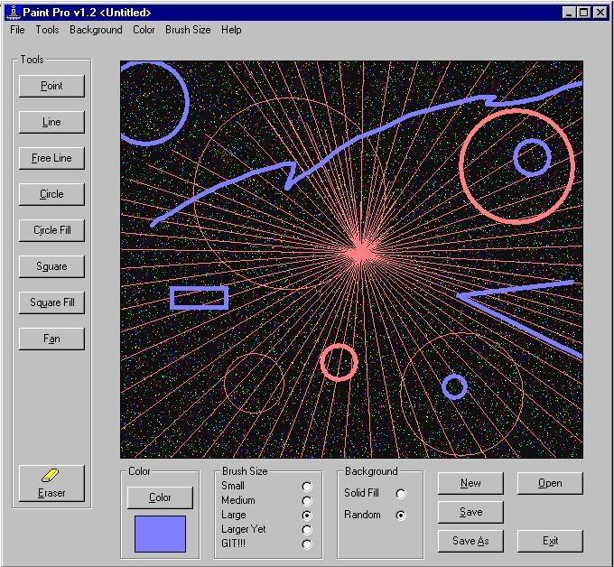



## Ace Paint 1\.3

### Description

This is an update of my previous Paint post. It now features "live drawing". The bugs that were pointed out are now fixed, thanks to all who responded! No API calls are used, pure VB. Please take a look at this and let me know if you want to see any features added. Vote if you like it. Thanks again for the responses last time!!!
 
### More Info
 

             |
---                |---
**Submitted On**   |2002-09-17 11:42:24
**By**             |[Gene Shoykhet](https://github.com/Planet-Source-Code/PSCIndex/blob/master/ByAuthor/gene-shoykhet.md)
**Level**          |Beginner
**User Rating**    |4.0 (8 globes from 2 users)
**Compatibility**  |VB 4\.0 \(32\-bit\), VB 5\.0, VB 6\.0
**Category**       |[Graphics](https://github.com/Planet-Source-Code/PSCIndex/blob/master/ByCategory/graphics__1-46.md)
**World**          |[Visual Basic](https://github.com/Planet-Source-Code/PSCIndex/blob/master/ByWorld/visual-basic.md)
**Archive File**   |[Ace\_Paint\_1323449172002\.zip](https://github.com/Planet-Source-Code/gene-shoykhet-ace-paint-1-3__1-39079/archive/master.zip)

